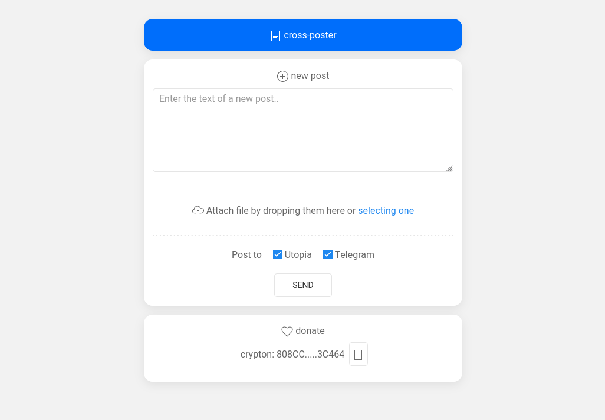

### How to start

```bash
cp config.example.json config.json
```

update config in `config.json`:

* `utopia.token` - your API token from Utopia API Settings;
* `utopia.channel_id` - the ID of the channel in which the account is an administrator or moderator with the right to publish messages;
* `telegram.token` - your Telegram Bot token given from [https://t.me/BotFather](@BotFather);
* `telegram.chat_id` - your channel (chat) ID to post messages. You can find it out by using [https://t.me/getmyid_bot](@getmyid_bot);

### Build & run

```go
go build
./tool
```

App will be available at: `127.0.0.1:8080/` by default
